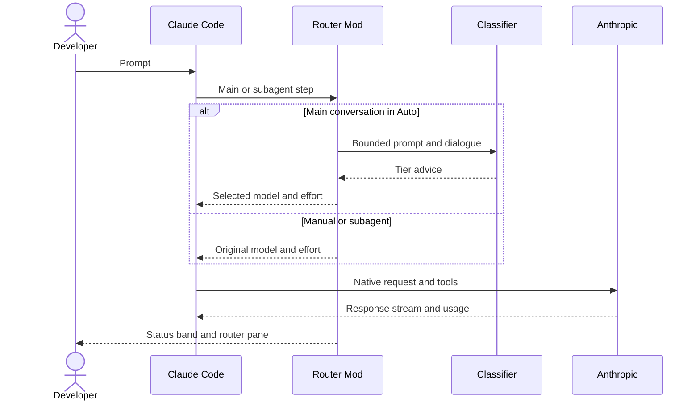

# Claude Model Router

> Vendored from [alexei-led/claude-router](https://github.com/alexei-led/claude-router) v1.4.0 (MIT, by Alexei Ledenev). Install with `npx claude-code-templates@latest --mod productivity/router`, or from the author's marketplace as described below. Report issues upstream. The code is unchanged; this README links to the upstream docs at the v1.4.0 tag.

[](https://github.com/alexei-led/claude-router/actions/workflows/ci.yml)
[](https://opensource.org/licenses/MIT)

**A Claude Code Mod that chooses a model and effort for each main-conversation turn, advised by a prompt classifier: Jev, or Cloudflare's Clef and Clef Flash.**

The Mod changes only the model and effort in Claude Code's turn hook. Claude Code sends the request, streams the reply, runs tools, and reports usage. The router does not proxy Anthropic traffic or start a local server. Subagent model choices pass through unchanged.


The band above the prompt shows the tier, model, and reason for each turn. `/router` opens a pane to pin a tier, edit the model and effort of each tier, and tune the policy. See the [user guide](https://github.com/alexei-led/claude-router/blob/v1.4.0/docs/user-guide.md#read-the-status-band).

The router needs Claude Code 2.1.289 or newer. Current savings are not measured. The panel shows Claude's reported usage and configured-price scenarios, not a savings total. See the [evaluation](https://github.com/alexei-led/claude-router/blob/v1.4.0/docs/evaluation.md).

## How it works



The active classifier labels a new logical turn once. Tool continuations keep that choice. A local policy applies vote, context, failure, and cache-cost rules before the Mod changes the next step. Claude Code owns request construction, model credentials, tools, streaming, and the API cost ledger.

| Tier     | Default model | Effort   |
| -------- | ------------- | -------- |
| `micro`  | Haiku 5.5     | `medium` |
| `low`    | Haiku 5.5     | `high`   |
| `medium` | Opus 5.5      | `medium` |
| `high`   | Opus 5.5      | `xhigh`  |

These are routing defaults. They do not claim equal model quality. [Configuration](https://github.com/alexei-led/claude-router/blob/v1.4.0/docs/configuration.md#built-in-defaults) gives the published results behind them and the `router.json` lines that restore the 1.3 Sonnet ladder.

## Install

You need Claude Code 2.1.289 or newer and credentials for one classifier: a Jev API key from [typesafe.ai](https://typesafe.ai), or a Cloudflare API token and account ID for [Clef or Clef Flash](https://developers.cloudflare.com/workers-ai/models/clef/) on Workers AI.

```sh
claude plugin marketplace add alexei-led/claude-router
claude plugin install router@alexei-led-claude-router
```

Start Claude Code on the full baseline model, for example `claude --model claude-haiku-5-5`. Run `/plugin configure router` and save the key. For Clef or Clef Flash, save the Cloudflare token and account ID, then pick the classifier on the pane's Classifier tab. A new session on a model that one of the tiers routes to starts in Auto; on another model it starts in Manual, and `/router auto` turns routing on.

Claude Code updates the plugin at startup when auto-update is on for this marketplace. Otherwise run `claude plugin marketplace update alexei-led-claude-router`, then `claude plugin update router@alexei-led-claude-router`.

Upgrading from 0.8? Remove the gateway settings that 0.8 `/router:setup` wrote before the first 1.0 session, or requests go to a gateway that 1.0 no longer starts. Follow the [migration steps](https://github.com/alexei-led/claude-router/blob/v1.4.0/docs/user-guide.md#move-from-v08-gateway-setup).

## Install from this catalog

```sh
npx claude-code-templates@latest --mod productivity/router
```

This writes the Mod to `.claude/skills/router/`, which Claude Code loads as `router@skills-dir` in a trusted project. Save the classifier key with `/plugin configure router`, or set `TYPESAFE_API_KEY` (Jev) or `CLOUDFLARE_API_TOKEN` and `CLOUDFLARE_ACCOUNT_ID` (Clef, Clef Flash) in the environment. Start on a model that one of the tiers routes to, for example `claude --model claude-haiku-5-5`.

Run `/router` to open the pane: route status, per-tier controls, tuning, and usage. Run `/model` to select a model and enter Manual mode, and `/router auto` to resume. For controls, metrics, tuning, and troubleshooting, see the [user guide](https://github.com/alexei-led/claude-router/blob/v1.4.0/docs/user-guide.md).

## Documentation

- [User guide](https://github.com/alexei-led/claude-router/blob/v1.4.0/docs/user-guide.md): install, use the controls, read the panel, and troubleshoot.
- [Configuration](https://github.com/alexei-led/claude-router/blob/v1.4.0/docs/configuration.md): classifiers and keys, the optional profile `router.json`, defaults, and migrations.
- [Architecture](https://github.com/alexei-led/claude-router/blob/v1.4.0/docs/architecture.md): Mod event flow, state, safeguards, and runtime boundaries.
- [Native router details](https://github.com/alexei-led/claude-router/blob/v1.4.0/docs/native-router.md): panel semantics, tuning, and accepted limits.
- [Evaluation](https://github.com/alexei-led/claude-router/blob/v1.4.0/docs/evaluation.md): historical gateway results and the native shadow replay.
- [Changelog](https://github.com/alexei-led/claude-router/blob/v1.4.0/CHANGELOG.md): user-visible changes by version.
