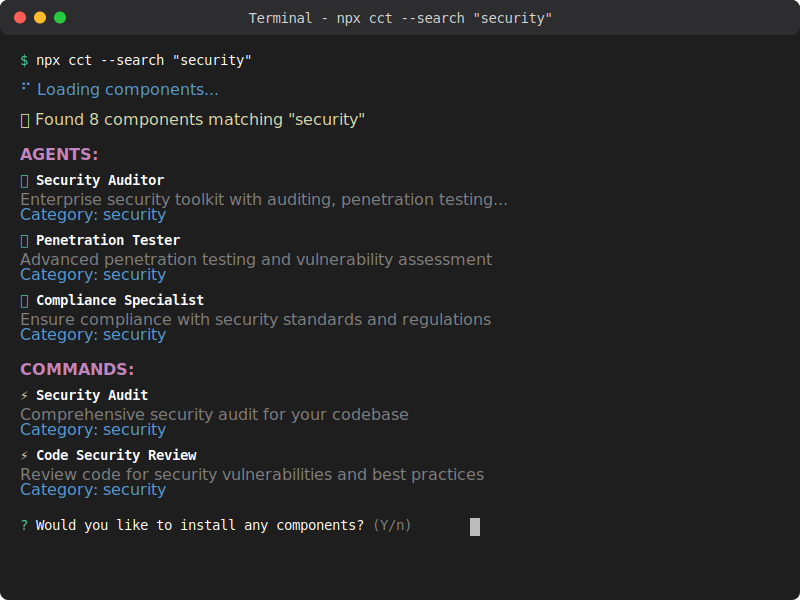
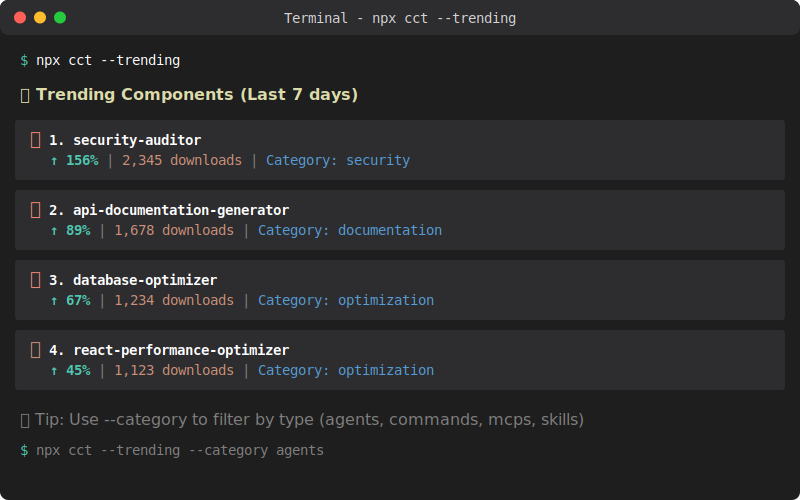
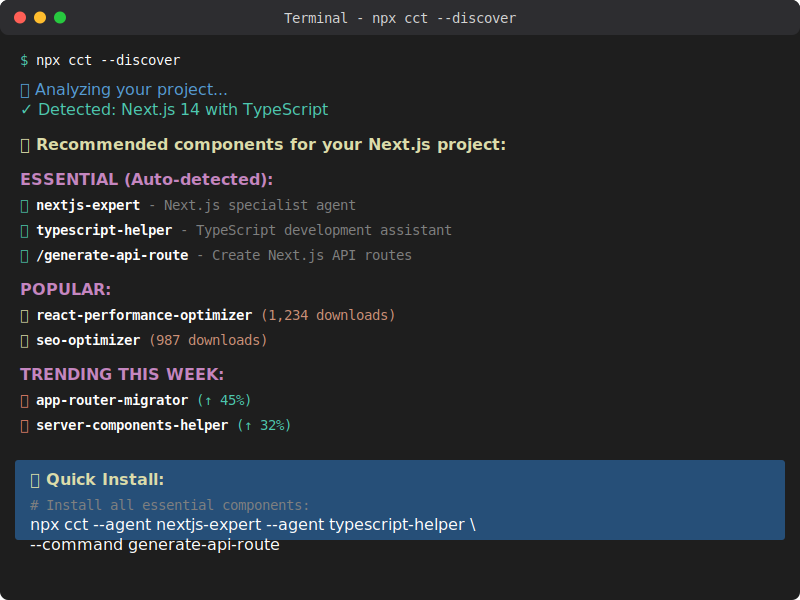
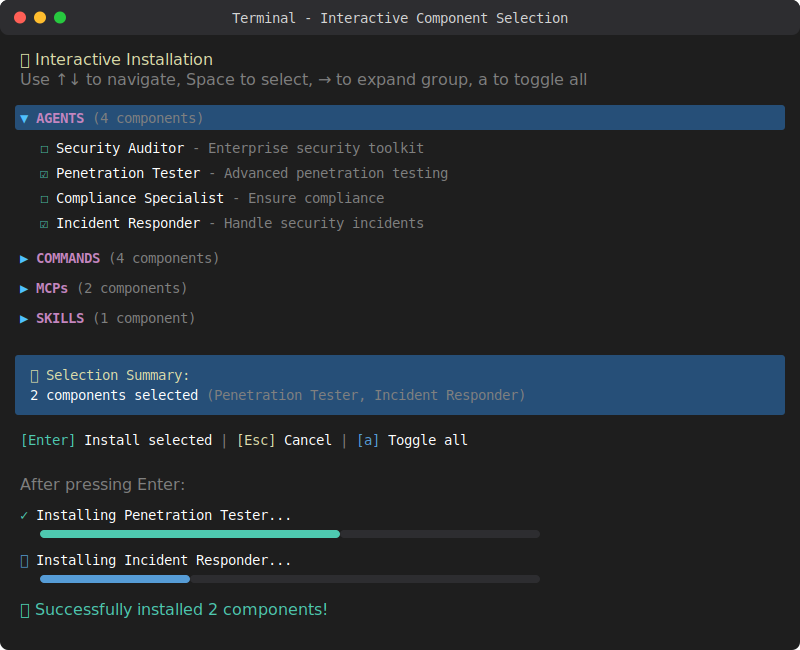

# Search & Discovery Examples

Visual examples of the CLI search and discovery features in action.

## 🔍 Search Components

Search for components by name, description, or category:

```bash
npx cct --search "security"
```



## 📈 Trending Components

See what's trending in the community:

```bash
npx cct --trending
```



## 🎯 Smart Discovery

Auto-detect your project type and get personalized recommendations:

```bash
npx cct --discover
```



## 📦 Interactive Selection

Browse and select multiple components with an interactive UI:



### Interactive Controls

- `↑↓` - Navigate between items
- `→` - Expand/collapse groups
- `Space` - Select/deselect item
- `a` - Toggle all items
- `Enter` - Install selected components
- `Esc` - Cancel

## More Examples

### Search by Category

```bash
npx cct --search "react" --category agents
```

### Filter Trending by Type

```bash
npx cct --trending --category commands
```

### Discover for Specific Project

```bash
npx cct --discover --project-type nextjs
```

### View Popular Components

```bash
npx cct --popular
```
