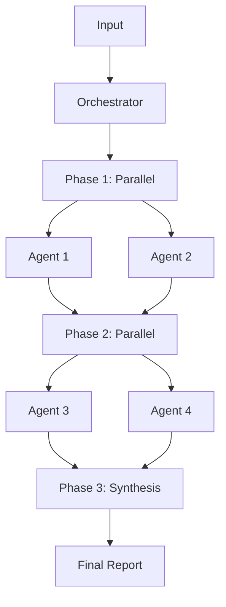

# [Team Name]

> [One-line description of what your team does]

## Overview

The [Team Name] is an autonomous system of specialized AI agents that work together to [MAIN PURPOSE]. Each agent has a specific role, and they coordinate through an orchestrator to deliver comprehensive results.

## Features

- ✨ **[Feature 1]**: [Description]
- 🚀 **[Feature 2]**: [Description]
- 🎯 **[Feature 3]**: [Description]
- 💡 **[Feature 4]**: [Description]
- 🔒 **[Feature 5]**: [Description]

## Quick Start

### Installation

```bash
# Install via CLI
claude-code install [TEAM-NAME]

# Or add to your project
cd your-project
claude-code add-team [TEAM-NAME]
```

### Basic Usage

```bash
# Run the full team
claude-code --team [TEAM-NAME] --target [YOUR-TARGET]

# Run specific agents only
claude-code --team [TEAM-NAME] --agents [agent-1],[agent-2]

# Run specific phase
claude-code --team [TEAM-NAME] --phase [PHASE-NAME]
```

### Example

```bash
# Example command
claude-code --team [TEAM-NAME] --target ./data

# Output: [TEAM-NAME]-report.md
```

## Team Members

### Orchestrator
- **[Orchestrator Name]**: Coordinates the entire workflow, delegates tasks, and synthesizes results

### Specialized Agents

#### Phase 1: [Phase Name]
- **[Agent 1]**: [What it does]
- **[Agent 2]**: [What it does]

#### Phase 2: [Phase Name]
- **[Agent 3]**: [What it does]
- **[Agent 4]**: [What it does]

#### Phase 3: Synthesis
- **Orchestrator**: Aggregates all findings into final report

## Workflow



### Execution Flow

1. **Input Analysis**: Orchestrator analyzes the scope and complexity
2. **Phase 1**: Core agents run in parallel
3. **Phase 2**: Specialized agents process results from Phase 1
4. **Phase 3**: Orchestrator synthesizes all findings
5. **Output**: Comprehensive report with recommendations

## Configuration

### Custom Configuration

Create a custom `team.yaml`:

```yaml
team:
  name: [TEAM-NAME]
  
agents:
  - id: [agent-1]
    priority: 1
    enabled: true
    
workflow:
  mode: hybrid
  
optimization:
  caching:
    enabled: true
  parallelism:
    max_concurrent_agents: 5
```

### Environment Variables

```bash
# Optional configuration
export TEAM_LOG_LEVEL=info
export TEAM_CACHE_DIR=./.cache
export TEAM_OUTPUT_FORMAT=markdown
```

## Use Cases

### Use Case 1: [Use Case Name]
```bash
# Command
claude-code --team [TEAM-NAME] --target [TARGET]

# What it does
[Description of what happens]

# Output
[What you get]
```

### Use Case 2: [Use Case Name]
```bash
# Command
claude-code --team [TEAM-NAME] --agents [agent-1],[agent-2]

# What it does
[Description]
```

### Use Case 3: [Use Case Name]
```bash
# Command
claude-code --team [TEAM-NAME] --phase [PHASE-NAME]

# What it does
[Description]
```

## Output Format

The team produces a comprehensive report:

```markdown
# [Team Name] Report

## Executive Summary
[High-level overview]

## Key Findings
[Most important results]

## Detailed Results

### [Category 1]
[Results from relevant agents]

### [Category 2]
[Results from relevant agents]

## Recommendations
1. [Action item 1]
2. [Action item 2]
3. [Action item 3]

## Metrics
- Items processed: X
- [Metric 2]: Y
- Total time: Z minutes
```

## Performance

| Metric | Value |
|--------|-------|
| Average execution time | [X] minutes |
| Accuracy | [Y]% |
| Items per minute | [Z] |
| Confidence threshold | 85% |

## Advanced Features

### Incremental Processing
Only process changed items:
```bash
claude-code --team [TEAM-NAME] --incremental
```

### Caching
Skip unchanged work:
```bash
claude-code --team [TEAM-NAME] --cache
```

### Custom Rules
Add your own rules:
```bash
# Create custom rule
echo "# My Rule" > rules/custom.md

# Use it
claude-code --team [TEAM-NAME] --rules rules/custom.md
```

## Examples

See [examples/](./examples/) for real-world usage examples:
- [Example 1](./examples/example-1.md)
- [Example 2](./examples/example-2.md)

## Documentation

- **[INDEX.md](INDEX.md)**: Complete navigation
- **[team.yaml](team.yaml)**: Team configuration
- **[orchestrator.md](orchestrator.md)**: Orchestrator guide
- **[CHANGELOG.md](CHANGELOG.md)**: Version history

### Agent Documentation
- [Agent 1](./agents/agent-1.md)
- [Agent 2](./agents/agent-2.md)
- [Agent 3](./agents/agent-3.md)

### Rules
- [Rule 1](./rules/rule-1.md)
- [Rule 2](./rules/rule-2.md)

## Troubleshooting

### Common Issues

**Issue**: Team runs slowly
```bash
# Solution: Enable caching and incremental mode
claude-code --team [TEAM-NAME] --cache --incremental
```

**Issue**: Too many false positives
```bash
# Solution: Increase confidence threshold
claude-code --team [TEAM-NAME] --min-confidence 95
```

**Issue**: Agent fails
```bash
# Solution: Check logs and retry
claude-code --team [TEAM-NAME] --log-level debug --retry
```

## Contributing

Want to improve this team?

1. Fork the repository
2. Make your changes
3. Test thoroughly
4. Submit a pull request

See [CONTRIBUTING.md](../../CONTRIBUTING.md) for guidelines.

## Roadmap

### Version 1.0 (Current)
- ✅ Core agents
- ✅ Basic orchestration
- ✅ Parallel execution

### Version 1.1 (Planned)
- ⏳ [Feature 1]
- ⏳ [Feature 2]
- ⏳ [Feature 3]

### Version 2.0 (Future)
- 📋 [Feature 1]
- 📋 [Feature 2]
- 📋 [Feature 3]

## License

[LICENSE TYPE] - See [LICENSE](LICENSE) file

## Support

- **Issues**: [GitHub Issues](https://github.com/[REPO]/issues)
- **Discussions**: [GitHub Discussions](https://github.com/[REPO]/discussions)
- **Email**: [SUPPORT-EMAIL]

## Credits

Created by [CREATOR-NAME]

Built with the Autonomous Team Template

## Related Teams

- [Related Team 1]: [Description]
- [Related Team 2]: [Description]

---

**Ready to get started?** Run `claude-code --team [TEAM-NAME] --help` for more options!
